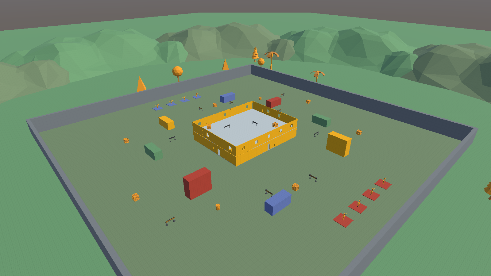
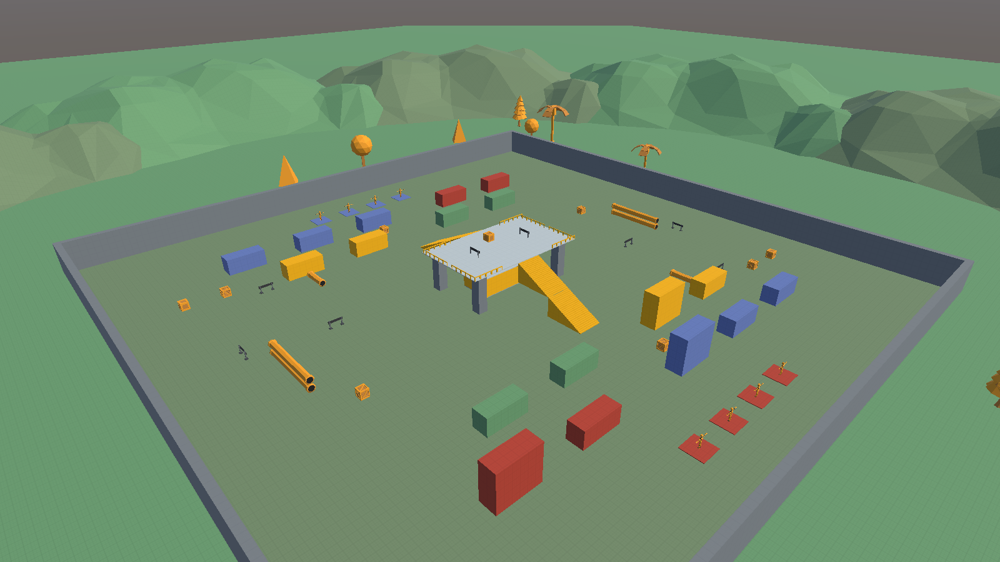

# ITU-CS-464-LAB-03-BSSE23040

Lab 03: level blockout. Two Team Deathmatch arenas in the style of PUBG Mobile, built from the provided **POLYGON Prototype Pack by Synty** and Unity cube game objects.

| Level | Scene | Idea |
|---|---|---|
| 1 | `Assets/Scenes/Lab03/Level1_Warehouse.unity` | A two-storey warehouse in the middle of the arena, with containers and cover around it |
| 2 | `Assets/Scenes/Lab03/Level2_Docks.unity` | Staggered container lanes and a crane gantry deck 6 m up |

- **Lab document (docx and PDF) and the Scene view walkthrough video:** `Submission/`
- **Reference images and gameplay video from PUBG Mobile:** `References/PUBG/`
- **Screenshots of both levels:** `Docs/screenshots/`
- **Synty assets used:** `Assets/Synty/` (only the 196 assets the levels need, about 7 MB; the full pack is not included)
- **Editor scripts:** `Assets/Editor/SyntyLevels.cs` builds the two levels, `Assets/Editor/LabTools.cs` takes the screenshots and flies the Scene view camera.

