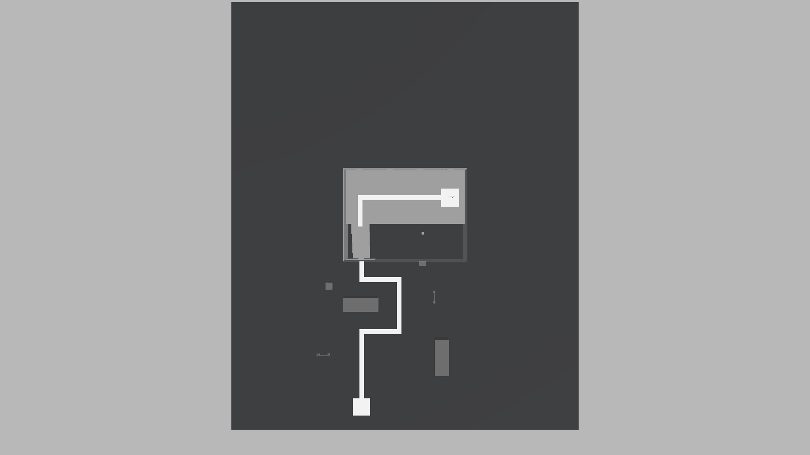

# ITU-CS-464-LAB-03-BSSE23040

Lab 03: level blockout. One simple grey-box Team Deathmatch warehouse in the style of PUBG Mobile, built from the provided **POLYGON Prototype Pack by Synty**.

- No scenery and no colour: only greys, with one marked default route (the light strip on the floor) from the spawn pad to the goal pad, about 65 m long.
- **Scene:** `Assets/Scenes/Lab03/Level_Warehouse.unity`
- **Lab document (docx and PDF) and the Scene view walkthrough video (follows the default route):** `Submission/`
- **Reference images and gameplay video from PUBG Mobile:** `References/PUBG/`
- **Screenshots of the level:** `Docs/screenshots/`
- **Synty pieces used:** `Assets/Synty/` (only the 13 prefabs the level needs, about 1 MB; the full pack is not included)
- **Editor scripts:** `Assets/Editor/SimpleLevels.cs` builds the level, `Assets/Editor/LabTools.cs` takes the screenshots and flies the Scene view camera along the route.

