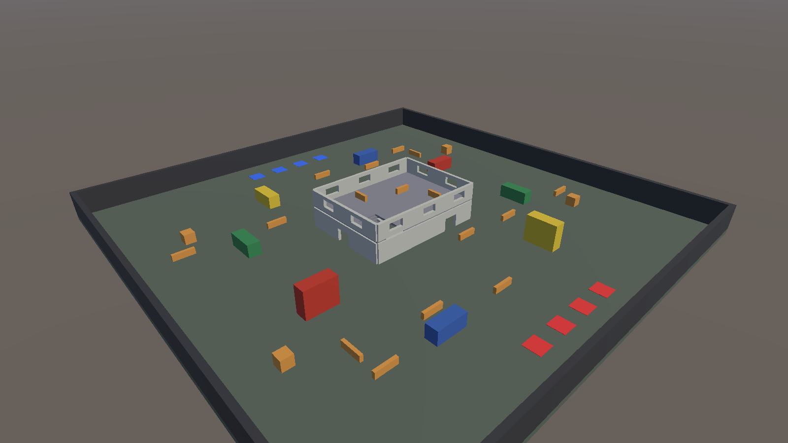
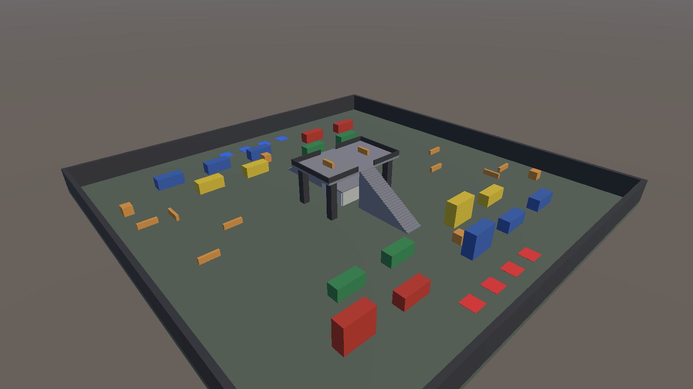

# ITU-CS-464-LAB-03-BSSE23040

Lab 03: level blockout. Two Team Deathmatch arenas in the style of PUBG Mobile, built from Unity primitive cubes.

| Level | Scene | Idea |
|---|---|---|
| 1 | `Assets/Scenes/Blockout/TDM_01_Warehouse.unity` | A big two-storey warehouse in the middle, with containers and crates around it |
| 2 | `Assets/Scenes/Blockout/TDM_05_Docks.unity` | Staggered container lanes and a crane gantry deck 8.5 m up |

- **Lab document (docx and PDF) and the Scene view walkthrough video:** `Submission/`
- **Reference images and gameplay video from PUBG Mobile:** `References/PUBG/`
- **Screenshots of both levels:** `Docs/screenshots/`
- **Editor scripts:** `Assets/Editor/BlockoutBuilder.cs` builds the levels, `Assets/Editor/LabTools.cs` takes the screenshots and flies the Scene view camera.

